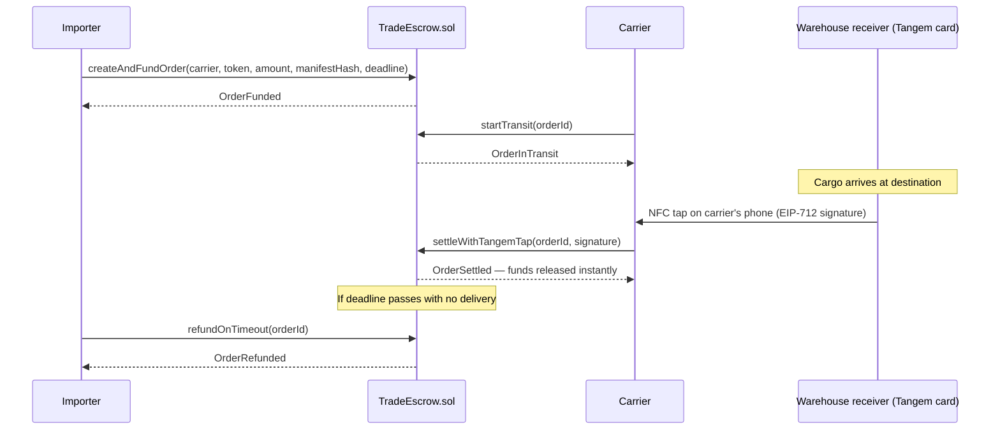

# Architecture

## Problem → Solution

Heavy-freight carriers on the Arica–Tambo Quemado–Santa Cruz/Cochabamba corridor get paid
30–60 days after unloading, and face fake-payment-proof scams at delivery. Importers pay
8–12% in bank/SWIFT fees and wait weeks for international transfers to clear.

`TradeEscrow.sol` custodies the freight payment in stablecoin and releases it instantly
when the warehouse receiver taps a **Tangem NFC card** confirming delivery — no oracle,
no waiting, no bank.

## Flow

## Contract

`TradeEscrow.sol` — states `Created → Funded → InTransit → Delivered / Refunded / Disputed`.

- `createAndFundOrder` — importer deposits stablecoin, order becomes `Funded`.
- `startTransit` — carrier/oracle marks cargo as dispatched.
- `settleWithTangemTap` — verifies the Tangem card's EIP-712 signature and pays the
  carrier instantly. The demo-day headline feature.
- `refundOnTimeout` — refunds the importer if the deadline passes with no delivery.
- `openDispute` / `resolveDispute` — **open design gap**: the `Disputed` state exists in
  the enum but has no handler yet. If the importer never signs (bad faith or error), the
  carrier currently has no recourse besides `refundOnTimeout`, which favors the importer.
  Needs a designated arbiter for the MVP.

Full spec: see `02-Arquitectura/SPEC.md` in the `cocha-blockchain` planning repo.

## Stack

- Solidity 0.8.24 + Foundry
- Avalanche Fuji Testnet
- Pollar (BOB → USDC onramp)
- Next.js + wagmi/viem
- Tangem NFC hardware card (EAL6+ secure chip)

## Known risks

- **Web NFC API only works in Chrome on Android** — not supported in Safari/iOS. Demo
  must run on an Android device, or fall back to the native Tangem SDK / a passkey button.
- Pollar's network compatibility with Avalanche Fuji is unconfirmed — verify with Pollar
  support before demo day.
