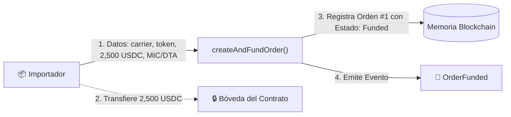
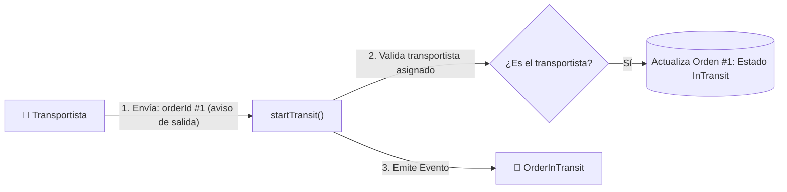
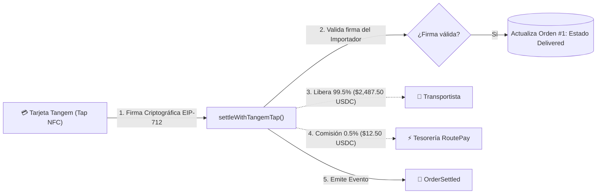
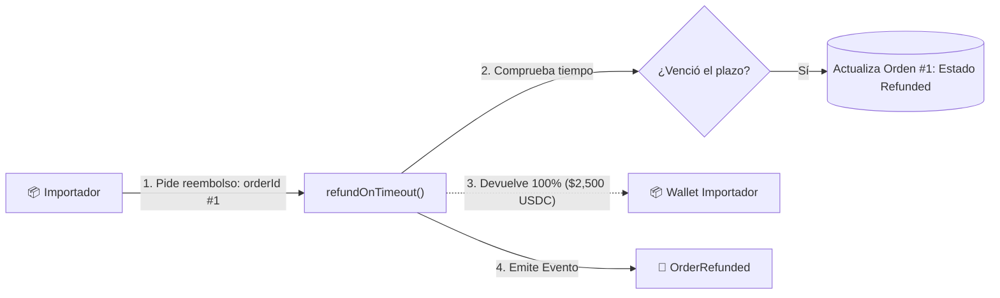
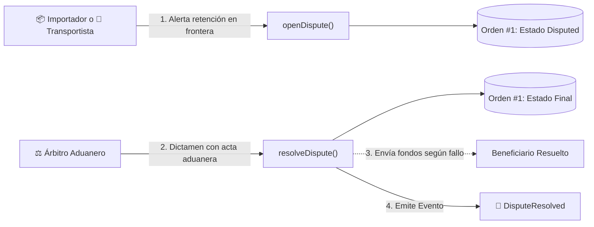
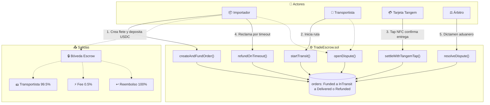

# 📊 RoutePay — Diagrama de Flujo de Datos del Backend

> **Responsable:** Ariane Somoza ([@arianesomoza](https://github.com/arianesomoza))  
> **Referencia:** [Issue #1 — Diagrama de flujo de datos del backend (TradeEscrow.sol)](https://github.com/RoutePay-Protocol/routepay/issues/1)  
> **Contrato Auditado:** [`contracts/src/TradeEscrow.sol`](../contracts/src/TradeEscrow.sol)  
> **Visualizador Web Interactivo:** [`docs/diagrama_flujo_datos.html`](./diagrama_flujo_datos.html)

---

## 💡 Concepto General

El backend de RoutePay no es un servidor centralizado, sino un **Smart Contract** en Avalanche Fuji ([`TradeEscrow.sol`](../contracts/src/TradeEscrow.sol)) que funciona como una **caja fuerte inteligente y automatizada**:
1. Recibe el depósito del flete en stablecoin (USDC) y los datos de aduana (MIC/DTA).
2. Monitorea el ciclo de vida del transporte (Creado ➔ Tránsito ➔ Entrega).
3. Liquida los fondos **en segundos** cuando el almacén receptor apoya una **tarjeta física Tangem NFC** contra el celular.

---

## 🔄 Los 5 Procesos Clave

### 1. 📦 Creación de Orden y Custodia de Fondos (`createAndFundOrder`)

El importador registra la operación internacional y deposita los fondos.

* **📥 Entradas:** Dirección del transportista (`carrier`), token USDC, monto ($2,500 USDC), hash del MIC/DTA (`cargoManifestHash`), plazo en segundos (`durationSeconds`).
* **💾 Almacenamiento:** Se crea el struct `EscrowOrder` con `orderId = 1`, estado `Funded` y se calcula la fecha límite `deadline = block.timestamp + durationSeconds`.
* **📤 Salidas:** 2,500 USDC transferidos de la wallet del importador a la bóveda del contrato. Emisión del evento `OrderFunded`.

---

### 2. 🚚 Inicio de Tránsito en Carretera (`startTransit`)

El transportista notifica la salida de la carga desde el puerto o centro logístico (ej. Arica).

* **📥 Entradas:** `orderId`.
* **💾 Almacenamiento:** El contrato comprueba que `msg.sender == order.carrier` y actualiza el estado a `EscrowStatus.InTransit`.
* **📤 Salidas:** Fondos permanecen bloqueados. Emisión del evento `OrderInTransit`.

---

### 3. 💳 Tap Tangem NFC y Liquidación Instantánea (`settleWithTangemTap`)

La carga llega a destino (ej. Santa Cruz). El receptor apoya su tarjeta física Tangem y el contrato liquida automáticamente.

* **📥 Entradas:** `orderId` y la firma criptográfica (`signature`) generada por el chip EAL6+ de la tarjeta física Tangem.
* **💾 Almacenamiento:** Recupera al firmante vía `ECDSA.tryRecover`, verifica autorización y cambia el estado a `EscrowStatus.Delivered`.
* **📤 Salidas:**
  * **$2,487.50 USDC (99.5%):** Transferidos a la wallet del transportista en el acto.
  * **$12.50 USDC (0.5%):** Transferidos a la tesorería del protocolo.
  * Emisión del evento `OrderSettled`.

---

### 4. ⏱️ Plazo Vencido y Reembolso Autónomo (`refundOnTimeout`)

Si el transportista no entrega antes de la fecha límite acordada, el importador recupera sus fondos sin intermediación.

* **📥 Entradas:** `orderId`.
* **💾 Almacenamiento:** Comprueba que `block.timestamp >= order.deadline` y muta el estado a `EscrowStatus.Refunded`.
* **📤 Salidas:** El 100% de los fondos ($2,500 USDC) regresan a la wallet del importador. Emisión de `OrderRefunded`.

---

### 5. ⚖️ Contingencia o Retención en Frontera (`openDispute` / `resolveDispute`)

En caso de bloqueo o retención en frontera (ej. Tambo Quemado), se congela el flete hasta la resolución de un árbitro con actas oficiales.

* **📥 Entradas:** `orderId` para abrir; `orderId` y booleano `refundImporter` para dictaminar.
* **💾 Almacenamiento:** Estado `Disputed` congela el contrato; luego pasa a `Refunded` o `Delivered`.
* **📤 Salidas:** Fondos entregados al beneficiario dictaminado. Emisión de `DisputeResolved`.

---

## 🌐 Mapa Global Integrado

