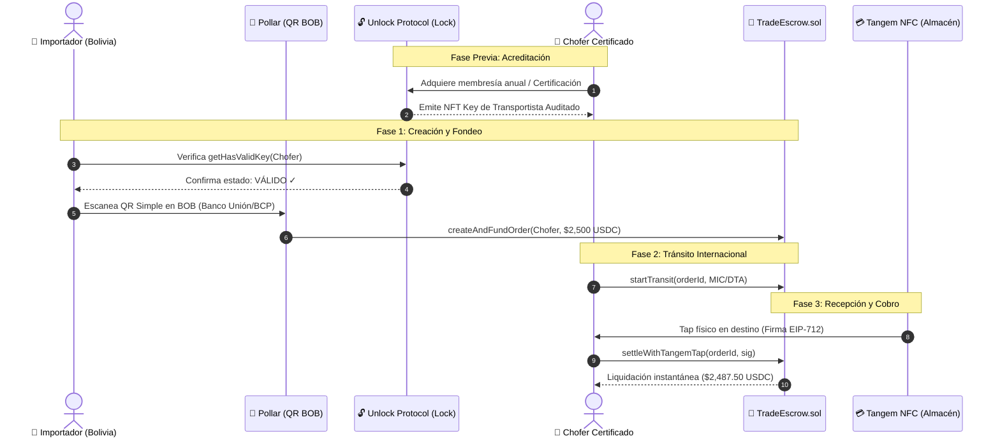

# Integración de Pollar y Unlock Protocol en RoutePay

> **Documento de Arquitectura y Sinergia Tecnológica**
> **Proyecto:** RoutePay (Buildathon ETH Bolivia 2026)
> **Componentes analizados:** Pollar (Fiat On-Ramp) + Unlock Protocol (Token-Gated Carrier Credential)

---

## 1. El Rol de Cada Tecnología en RoutePay

| Tecnología | Rol en RoutePay | Problema que resuelve |
|---|---|---|
| 📱 **Pollar** | **Motor de On-Ramp (BOB ➔ USDC)** | El importador boliviano no tiene cripto nativa ni usa exchanges complejos. Paga el flete en **Bolivianos (BOB)** escaneando un código **QR Simple** desde su app bancaria (Banco Unión, BCP, BNB). Pollar convierte y fondea la orden en USDC en la blockchain. |
| 🔓 **Unlock Protocol** | **Credencial On-Chain y Control de Acceso (PublicLock)** | En logística internacional (Arica ➔ Santa Cruz), el importador no puede confiar un flete de $50,000 USD a una wallet anónima. Unlock emite un **Lock de Transportista Certificado**; solo los choferes auditados con una **Key activa (NFT)** pueden tomar fletes de alto valor. |

---

## 2. Sinergia: Cómo se Aportan Entre Sí

En el comercio exterior, la transacción tiene dos pilares indispensables: **el dinero** y **la confianza en la persona que traslada la mercadería**.

$$\text{Operación Segura} = \underbrace{\text{Pollar (Liquidez Fiat)}}_{\text{¿Cómo pago con dinero local?}} + \underbrace{\text{Unlock Protocol (Reputación On-Chain)}}_{\text{¿En qué chofer confío la carga?}}$$

### El Ciclo Integrado de Confianza:
1. **Verificación de Identidad (Unlock Protocol):** La Cámara de Transporte o aduana emite un contrato `PublicLock` de Unlock. El chofer posee en su wallet una credencial NFT válida que certifica su camión, licencia y póliza de seguro.
2. **Selección y Validación:** Al crear la orden, RoutePay consulta a Unlock (`lock.getHasValidKey(carrierAddress)`). Si el chofer no tiene credencial vigente, el sistema rechaza la asignación para evitar estafas de carga fantasma.
3. **Fondeo Local (Pollar):** El importador confirma al chofer y paga en Bolivianos con **QR Simple Pollar**. Pollar deposita los USDC en el contrato de custodia `TradeEscrow.sol`.
4. **Tránsito y Telemetría:** El flete recorre los 1,200 km por Tambo Quemado.
5. **Liquidación Física (Tangem NFC):** El almacén receptor hace tap con su tarjeta Tangem de hardware (EAL6+). El contrato verifica la firma EIP-712 y libera los USDC de Pollar directamente a la wallet del transportista verificado por Unlock.

---

## 3. Diagrama de Flujo Técnico

---

## 4. Qué Necesitamos Hacer en Nuestro Proyecto

Para materializar ambos aportes en el código y cumplir con los criterios de evaluación de ambos tracks:

### A. Para Pollar:
- [x] **UI de Pago QR:** Pestañas bancarias locales (Banco Unión, BCP, BNB) y simulación de conversión BOB ➔ USDC (`PollarQrModal.tsx`).
- [ ] **SDK Oficial:** Conectar `@pollar/core` o `@pollar/react` apuntando a la API/Widget oficial de Pollar.
- [ ] **Tx en Mainnet/Testnet:** Registrar el hash verificable del on-ramp como evidencia técnica para el jurado.

### B. Para Unlock Protocol:
- [ ] **Despliegue del Lock:** Instanciar un contrato `PublicLock` de Unlock Protocol en Avalanche Fuji (o Polygon/Base) mediante el Unlock Dashboard o SDK:
  - Nombre: `RoutePay Verified Carrier Lock`
  - Duración: 365 días (membresía anual del transportista).
- [ ] **Lectura en Frontend (`useTradeEscrow` o `OrderCreationForm`):**
  - Chequear la condición `lock.getHasValidKey(carrierAddress)`.
  - Mostrar en la interfaz el badge dorado: **"Transportista Verificado por Unlock Protocol ✓"**.
- [ ] **README y Documentación:** Incluir el Lock Address y la justificación de uso en el README oficial para la entrega del bounty de Unlock.
